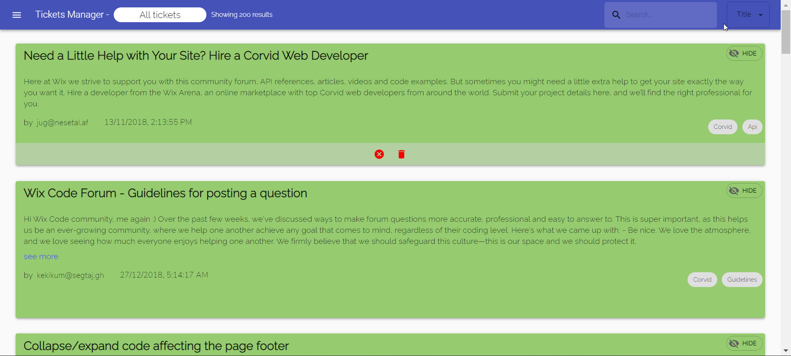

# Tickets Manager

## link to Demo application

[My glitch project](https://tickets-manager-dk.glitch.me)

## Info

`Type` - Full-Stack

`Framework` - React.js , Node.js

### Central Libraries :

- Material-UI
- Infinite Scroll
- Sweetalert2
- Axios
- Express

This app is an interface for a current company to handle inquiries and issues addressed to it. I developed the app with a variety of options to give comfortable and fun work experiences.

### Card actions:

Each card has a number of actions that can be taken:

- The ticket has already been performed
- The ticket not performed yet
- Hide a ticket
- Delete a ticket

### Search

I separated the search into 3 options, you can search by title, content or email. All this to give comfortable user experiences that he can quickly find the right result for him.

### Side menu & top menu:

In the side window you can see all possible ticket modes. Each time you click on one of the modes the tickets are rendering by this mode.

At any given moment, the number of tickets displayed on the screen appears in the top menu, according to the type of mode we selected in the side menu.

You can note that if possible hide a ticket will be displayed in the top menu that a ticket has been hidden and can be returned. If we have only removed a ticket that has been done and we are on the ticket that has not been done yet, we will not be shown that there are hidden tickets, because the hidden ticket is a done ticket and has no connection to the undone ticket.

If a card is deleted and hidden it will not appear in the deleted list because it is hidden.

### Soft delete:

So that I could view the deleted tickets, I performed a technology called `soft delete`. This means that I do not delete the tickets from my database, since I have a prop for each ticket whether it is deleted or not and it gets a Boolean variable.

This gives me the knowledge of which tickets have been deleted and also the data on them without physically deleting from the database.

What I have left to do is when I return information from API request, is to return only the tickets in the `deleted` prop the value is `FALSE`.

Same goes for hide.
